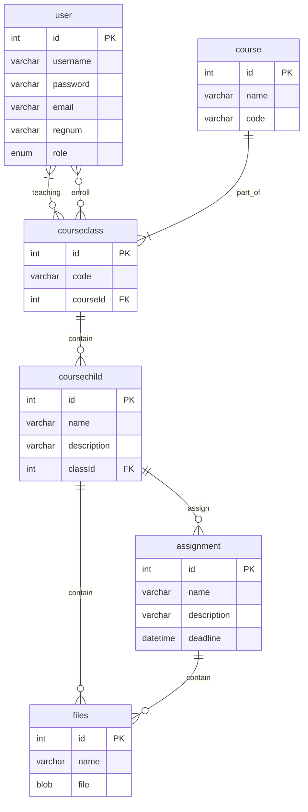

# Express Server

## Entity Relationship Diagram

#### Authenticating user

 
<code>POST</code> <code><b>/</b></code>

##### Header
> | name | type | description |
> |-|-|-|
> | Authorization | required | Bearer `<master token set in .env>` |
##### Body

> | name | type | description |
> |-|-|-|
> | username | required | user username |
> | password | required | user password |

##### Responses

> | response | description |
> |-|-|
> | `{ token: string` | user is authenticated, returns jwt token |
> | `{ message: string }` | error message |

---

#### Users

 
<code>GET</code> <code><b>/users/me</b></code>

##### Header
> | name | type | description |
> |-|-|-|
> | Authorization | required | Bearer `<user token>` |

##### Responses
> | response | description |
> |-|-|
> | `{ id: number, name: string, username: string, password: string, email: string, regnum: string, phone: string, birthdate: date, avatar: string, role: string, created_at: date, updated_at: date }` | user data |
> | `{ message: string }` | error message |

 
<code>PUT</code> <code><b>/users/me</b></code>

##### Header
> | name | type | description |
> |-|-|-|
> | Authorization | required | Bearer `<user token>` |

##### Body
> | name | type | description |
> |-|-|-|
> | phone | optional | user phone |
> | avatar | optional | user avatar |

##### Responses
> | response | description |
> |-|-|
> | `{ id: number, name: string, username: string, password: string, email: string, regnum: string, phone: string, birthdate: date, avatar: string, role: string, created_at: date, updated_at: date }` | user data |
> | `{ message: string }` | error message |

---
#### Course

 
<code>GET</code> <code><b>/courses</b></code>

##### Header
> | name | type | description |
> |-|-|-|
> | Authorization | required | Bearer `<user token>` |

##### Responses
> | response | description |
> |-|-|
> | `{ courses: [ { id: number, name: string, code: string, created_at: date, updated_at: date } ] }` | all courses data |
> | `{ message: string }` | error message |

 
<code>POST</code> <code><b>/courses</b></code>

##### Header
> | name | type | description |
> |-|-|-|
> | Authorization | required | Bearer `<lecturer token>`

##### Body
> | name | type | description |
> |-|-|-|
> | name | required | course name |
> | code | required | course code |

##### Responses
> | response | description |
> |-|-|
> | `{ id: number, name: string, code: string, created_at: date, updated_at: date }` | course data |
> | `{ message: string }` | error message |

 
<code>GET</code> <code><b>/courses/:id</b></code>

##### Header
> | name | type | description |
> |-|-|-|
> | Authorization | required | Bearer `<user token>` |

##### Responses
> | response | description |
> |-|-|
> | `{ id: number, name: string, code: string, created_at: date, updated_at: date }` | course data |

 
<code>PUT</code> <code><b>/courses/:id</b></code>

##### Header
> | name | type | description |
> |-|-|-|
> | Authorization | required | Bearer `<lecturer token>` |

##### Body
> | name | type | description |
> |-|-|-|
> | name | optional | course name |
> | code | optional | course code |

##### Responses
> | response | description |
> |-|-|
> | `{ id: number, name: string, code: string, created_at: date, updated_at: date }` | course data |
> | `{ message: string }` | error message |

 
<code>DELETE</code> <code><b>/courses/:id</b></code>

##### Header
> | name | type | description |
> |-|-|-|
> | Authorization | required | Bearer `<lecturer token>` |

##### Responses
> | response | description |
> |-|-|
> | `{ message: string }` | success message |
> | `{ message: string }` | error message |

 
<code>POST</code> <code><b>/courses/:id</b></code>

##### Header
> | name | type | description |
> |-|-|-|
> | Authorization | required | Bearer `<lecturer token>` |

##### Body
> | name | type | description |
> |-|-|-|
> | code | required | class code |

##### Responses
> | response | description |
> |-|-|
> | `{ id: number, code: string, courseId: number, created_at: date, updated_at: date }` | class data |
> | `{ message: string }` | error message |

 
<code>PUT</code> <code><b>/courses/:id/classes/:classId</b></code>

##### Header
> | name | type | description |
> |-|-|-|
> | Authorization | required | Bearer `<lecturer token>` |

##### Body
> | name | type | description |
> |-|-|-|
> | code | optional | class code |

##### Responses
> | response | description |
> |-|-|
> | `{ id: number, code: string, courseId: number, created_at: date, updated_at: date }` | class data |
> | `{ message: string }` | error message |

 
<code>DELETE</code> <code><b>/courses/:id/classes/:classId</b></code>

##### Header
> | name | type | description |
> |-|-|-|
> | Authorization | required | Bearer `<lecturer token>` |

##### Responses
> | response | description |
> |-|-|
> | `{ message: string }` | success message |
> | `{ message: string }` | error message |

 
<code>POST</code> <code><b>/courses/:id/classes/:classId</b></code>

##### Header
> | name | type | description |
> |-|-|-|
> | Authorization | required | Bearer `<lecturer token>` |

##### Body
> | name | type | description |
> |-|-|-|
> | name | required | class child name |
> | description | optional | class child description |

##### Responses
> | response | description |
> |-|-|
> | `{ id: number, name: string, description: string, classId: number, created_at: date, updated_at: date }` | class child data |

 
<code>PUT</code> <code><b>/courses/:id/classes/:classId/children/:childId</b></code>

##### Header
> | name | type | description |
> |-|-|-|
> | Authorization | required | Bearer `<lecturer token>` |

##### Body
> | name | type | description |
> |-|-|-|
> | name | optional | class child name |
> | description | optional | class child description |

##### Responses
> | response | description |
> |-|-|
> | `{ id: number, name: string, description: string, classId: number, created_at: date, updated_at: date }` | class child data |

 
<code>DELETE</code> <code><b>/courses/:id/classes/:classId/children/:childId</b></code>

##### Header
> | name | type | description |
> |-|-|-|
> | Authorization | required | Bearer `<lecturer token>` |

##### Responses
> | response | description |
> |-|-|
> | `{ message: string }` | success message |
> | `{ message: string }` | error message |

